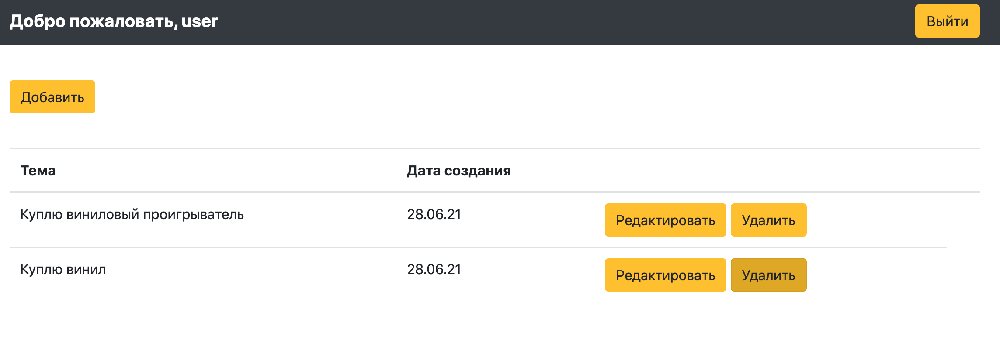
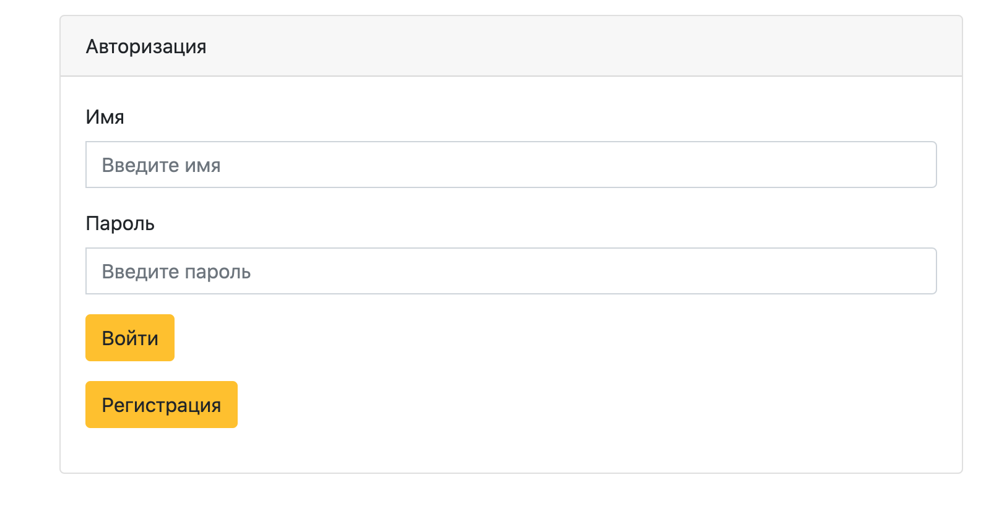
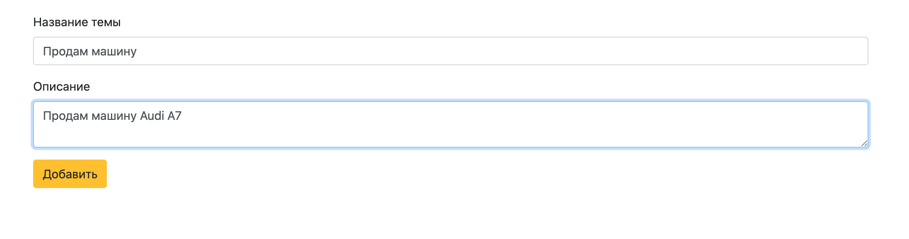

## Проект курса [job4j](http://job4j.ru)

### Форум

Приложение реализованно на [Heroku](https://shrouded-fjord-36787.herokuapp.com/)

Технологии:
- PostgresSQL
- Hibernate
- Spring Boot / Security / Data
- JSP / CSS / JS / JSTL
- Log4j
- JUnit / Mockito
- MVC / Singleton (On Demand Holder Idom)

Главная страница

Регистрация пользователя

Добавление обсуждения
